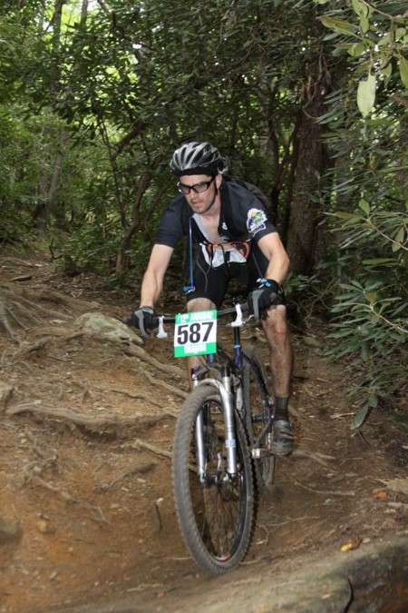

Lecture 01
==========

# Lecture Objectives
* Introductions
* Syllabus Review

# Who are we?
* Dr. Palmeri
  + Duke BME/ECE (1996--2000)
  + Duke BME Grad (2005)
  + Duke Med (2007)
  + Ultrasonic elasticity imaging
  + Medical instrumentation design
    - BME354L
    - BME464L
    - BME790L
    - BME590L

* [Suyash Kumar](http://suyashkumar.com/)
  + Duke BME/CS (2012-2016)
  + Founder & CTO [Gradient Health](https://gradienthealth.ai/)
  + [MicroElastic Ultrasound](http://microelastic.com/) CTO
  + Uber software engineer
  + Software lead on Duke's [POCkeT Colposcope](https://www.pocketcolposcope.com/) & other projects
  + Lifelong hacker

* Dr. Ward

* TA introductions

# Who are you?
* Name
* Ugrad/Grad?
* Hometown
* What you did this summer
* Long-term plans
* Fun fact

# Syllabus Review
